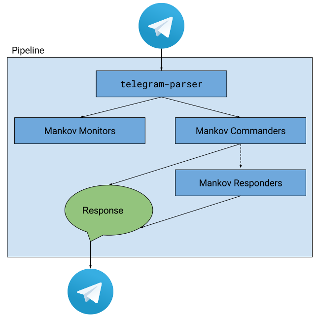

mankov-core 
=====================================================================

_Mankov_ is framework for building [Telegram Bots](https://core.telegram.org/bots/api). Its purpose is to do the mandatory bits required for communicating with Telegram's API, and you can focus only on implementating the actual logic & intelligence of your bot. 

_Mankov_ is slightly opinionated when it comes to how we think Telegram bots should be built. This code is forked from [BorisBot](https://github.com/miro/BorisBot), our first take on building a Telegram bot. Most of the opinions rise from there.

# Concepts & architechture

(**NOTE:** Naming of things in this section are subject to change, since you know, naming things is hard. Everything else will probably change also. Yau!)

Basic concept of Telegram Bot is quite simple. You subscribe to Telegram's Bot API and then receive all the messages (including pictures, stickers, videos, & whatnot). Then you react on those messages somehow (or ignore them, up to you).

In _Mankov-powered bot_ there is a _Pipeline_ where all those Telegram-sent messages are processed. All the messages are parsed by the `telegram-parser` which maps the information into more readable & flexible format. We call this format as an _Event_.

In the Pipeline there are three different kind of Event handlers:

## Monitors

Each event gets sent to all the _Monitor handlers_ which are attached to the Mankov instance. These handlers can process the Event in any way they like; they aren't expected to respond to the event in any way.

The usual usecase for _Monitor_ is logging the events somewhere.

## Commanders

...are handlers for Events in which the user directly interacts with the Bot. Each event will be sent to all attached _Commander handlers_ - there can be multiple of them. Each handler decides is this Event something that it will start to process or not. If handler is not interested in this particular Event, it can ignore it.

Single Event will be allowed to be "resolved" only by one _Commander handler_. If there happens a situation where multiple handlers tries to send a resolution to the Event, Mankov prompts user about what Commander they were trying to interact with.

The result of this is that single Event should alter internal state of at maximum only one _Commander handler_.

## Responders

If no Commander handler does not resolve the Event (or no Commander handlers are attached), the Event will be sent to all the _Responder handlers_ attached.

_Responder handlers_ are meant for implementing "human-like reactions" to messages. Each handler can decide on their own should they send some reaction to the Event they received or not.

Each reaction must define a _priority_. If there are multiple reactions for single Event, the reaction with the highest priority will be sent to the origin of the Event.

(The method of defining these priorities hasn't been solved yet.)

## Pipeline results

Monitors do what they do or don't do nothing. Pipeline is not interested about them.

If there are some Commanders which are interested in the Event, only one will be allowed to act on the Event. In this case the Event is not sent to Responders.

If Event goes to Responders, and some of them decide to react on it, at maximum only one reaction will be sent to the creator of Event.

=======

## Acknowledgements
This project is a grateful recipient of the [Futurice Open Source sponsorship program](http://futurice.com/blog/sponsoring-free-time-open-source-activities). ♥
